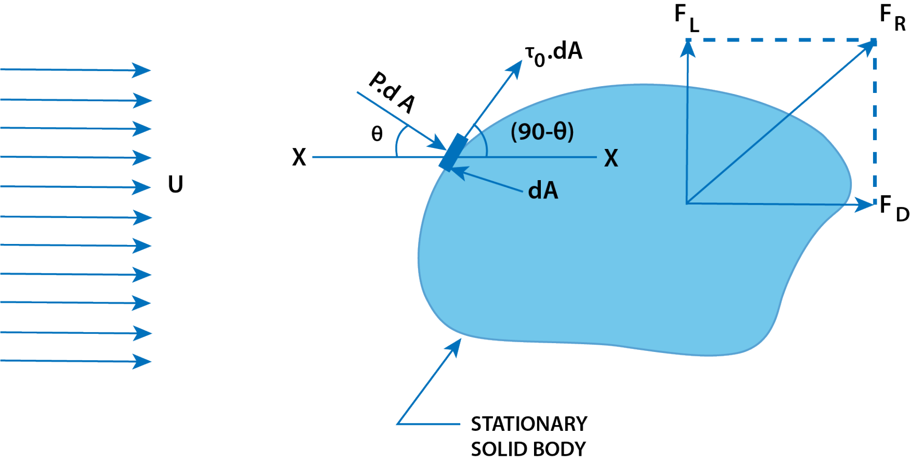

<h2>EXPRESSION FOR DRAG AND LIFT </h2>

Consider an arbitrary shaped solid body placed in a real fluid, which is flowing with a uniform velocity U in a horizontal direction as shown in Fig. 1. Consider a small elemental area dA on the surface of the body. The forces acting on the surface area dA are:

$$ Figure\ 1 \ Drag \ and \ lift $$

1. Pressure force equal to p × dA, acting perpendicular to the surface and
2. Shear force equal to to &#120591;0 × dA, acting along the tangential direction to the surface.   

Let 0 = Angle made by pressure force with horizontal direction.  

(a) <b>Drag Force (FD)</b>: The drag force on elemental area  = force due to pressure in the direction of fluid motion _ force due t oshear stress in the direction of fluid motion. 

$$ p \ dA \ cos(\theta) + \tau \ dA \ cos(90^o - \theta) = p \ dA \ cos(\theta) + \tau \ dA \ sin(\theta) $$

$$ \therefore  \ \ \text{Total drag} \ \ \ F_D = \text{Summation of p dA} \ cos(\theta) + \text{Summation of} \ \tau_0 \ dA \ sin(\theta) $$

$$ = \int p \ cos(\theta) \ dA + \int \tau_0 \ sin(\theta) \ dA $$

$$ \text{The term} \ \int p cos(\theta) \ dA \ \text{is called the called the pressure drag or form drag} $$

$$ \text{While the} \ \int \tau_0 sin(\theta) \ dA \ \text{is called the friction drag or skin drag or sheer drag} $$

 

(b) <b>Lift Force (FL)</b>: The lift force on element area = Force due to pressure in the direction perpendicular to the direction of motio + force due to shear stress in th direction prependicular to the direction of motion   

$$ -\rho dA \ sin(\theta) + \tau_0dA sin(90^o - \theta) = -pdA \ sin(\theta) + \tau \ dA \ cos(\theta) $$

Negative sign is taken with pressure force as it is acting in the downward direction while shear force is acting vertically up.

Therefore, the total lift:

$$
    F_L = \int \tau_0 \, dA \, \cos \, \theta - \int p \, dA \, \sin \, \theta = \int \tau_0 \, \cos \, \theta \, dA - \int p \, \sin \, \theta \, dA
$$

The drag and lift for a body moving in a fluid of density &rho; , at a uniform velocity U, are calculated mathematically, as

$$
    F_D = C_D \frac{\rho U^2}{2} A
$$

$$
    F_L = C_L \frac{\rho U^2}{2} A
$$

where

<ul>
    <li> CD = Coefficient of drag,</li>
    <li> CL  = Coefficient of lift,</li>
    <li> A = Projected area of the body perpendicular to the direction of flow, or the largest projected area of the immersed body.</li>
</ul>

The resultant force on the body, FR, is:

$$
    F_R = \sqrt{F_D^2 + F_L^2}
$$

 

<h2>Dimensional Analysis of Drag and Lift</h2>

The force exerted by a fluid on a supersonic plane is given by:

$$
    F = \rho L^2 U^2 \phi \left[ \frac{\mu}{\rho U L}, \frac{K}{\rho U^2} \right]
$$

For a partially submerged body, the force exerted by a fluid is given by:

$$
    F = \rho L^2 U^2 \phi \left[ \frac{\mu}{\rho U L}, \frac{L g}{U^2} \right]
$$

Thus, the general expression for the force exerted by a fluid (air or water) on a body (completely or partially submerged) is given as

$$
    F = \rho L^2 U^2 \phi \left[ \frac{\mu}{\rho U L}, \frac{L g}{U^2}, \frac{K}{\rho U^2} \right]
$$

where

<ul>
    <li> L  = Length of the body,</li>
    <li> U  = Velocity of the body,</li>
    <li> &mu;  = Viscosity of fluid,</li>
    <li> &rho;  = Density of fluid,</li>
    <li> F  = Force exerted,</li>
    <li> K  = Bulk modulus of fluid,</li>
    <li> g  = Acceleration due to gravity.</li>
</ul>

If the body is completely submerged in the fluid, the force exerted by the fluid on the body due to gravitational effect is negligible. 

$$ \text{Hence, the non-dimensional term containing 'g' in} \ \frac{L g}{U^2}, \ \text{is neglected.}  $$

 

If the ratio of the velocity of the body to the velocity of sound is less than 0.3, the force exerted by the fluid on the body due to compressibility is negligible. Therefore, the non-dimensional term in equation (14.6) containing \( K \) can be neglected.

The force exerted by the fluid on the body is then given as

$$
    F = \rho L^2 U^2 \phi \left[ \frac{\mu}{\rho U L} \right] = \rho L^2 U^2 \phi \left[ \frac{\rho U L}{\mu} \right]
$$

where

$$
    \frac{\rho U L}{\mu} = R_e
$$

where Re is the Reynolds number.

$$
    F = \rho L^2 U^2 \phi [R_e]
$$

Now F is the total force exerted by the fluid on the body. The total force has two components: one in the direction of motion called drag force, and another component in the direction perpendicular to the direction of motion, called lift force.

The two components of F are expressed as

$$
    F_D = \frac{\rho L^2 U^2}{2} \times C_D
$$

where CD is a function of Re and is called the coefficient of drag,

$$
    = C_D A \frac{\rho U^2}{2} \quad (\text{Since } L^2 = \text{Area} = A )
$$

And

$$
    F_L = \frac{\rho L^2 U^2}{2} \times C_L
$$

where CL is a function of Re and is called the coefficient of lift,

$$
    = C_L \cdot A \frac{\rho U^2}{2}
$$

<h3>Drag on a Sphere</h3>

Consider the flow of a real fluid past a sphere.

Let

<ul>
    <li> U  = Velocity of the flow of fluid over the sphere,</li>
    <li> D  = Diameter of the sphere,</li>
    <li> &rho;  = Mass density of fluid, and</li>
    <li> &mu;  = Viscosity of fluid.</li>
</ul>

If the Reynolds number of the flow is very small (less than 0.2), 

$$ \left(R_e \ = \frac{U D \rho}{\mu} < 0.2 \right) $$ 

the viscous forces are much more important than the inertial forces. In this case, the viscous forces dominate over the inertial forces, which may be assumed negligible.

G.G. Stokes developed a mathematical equation for the total drag on a sphere immersed in a flowing fluid for which Reynolds number is up to 0.2, so that inertia forces may be assumed negligible. According to his solution, the total drag is

$$
    F_D = 3 \pi \mu D U
$$

He further observed that out of the total drag given by Equation (14.8), two-thirds is contributed by skin friction and the remaining one-third by pressure difference. Thus

Skin friction drag,

$$
    F_{Df} = \frac{2}{3} F_D = \frac{2}{3} \times 3 \pi \mu D U = 2 \pi \mu D U
$$

and pressure drag,

$$
    F_{Dp} = \frac{1}{3} F_D = \frac{1}{3} \times 3 \pi \mu D U = \pi \mu D U
$$

<h4>(i) Expression of CD for Sphere when Reynolds Number is less than 0.2</h4>

From Equation above, the total drag is given by

$$
    F_D = C_D \times A \times \frac{\rho U^2}{2}
$$

For a sphere,

$$
    F_D = 3 \pi \mu D U
$$

where

$$
    A = \text{Projected area of the sphere} = \frac{\pi}{4} D^2
$$

Therefore,

$$
    3 \pi \mu D U = C_D \times \frac{\pi}{4} D^2 \frac{\rho U^2}{2}
$$

which simplifies to

$$
    C_D = \frac{3 \pi \mu D U}{\frac{\pi}{4} D^2 \times \frac{\rho U^2}{2}} = \frac{24 \mu}{\rho U D} = \frac{24}{R_e}
$$

$$ since \ \frac{\mu}{\rho D U} = R_e $$

Equation above is called "Stoke's law."

<h4>(ii) Value of CD for Sphere when Re is between 0.2 and 5</h4>

With the increase of Reynolds number, the inertia forces increase and must be taken into account. When Re lies between 0.2 and 5, Oseen, a Swedish physicist, improved Stoke’s law as

$$
    C_D = \frac{24}{R_e} \left( 1 + \frac{3}{16 R_e} \right)
$$

Equation is called "Oseen formulae" and is valid for Re between 0.2 and 5.

<h4>(iii) Value of CD for Re from 5.0 to 1000</h4>

The drag coefficient for the Reynolds number from 5 to 1000 is equal to 0.4.

<h4>(iv) Value of CD for Re from 1000 to 105</h4>

In this range, CD is independent of the Reynolds number and its value is approximately equal to 0.5.

<h4>(v) Value of CD for Re more than 105</h4>

The value of C_D is approximately equal to 0.2 for the Reynolds number more than 10^5.

